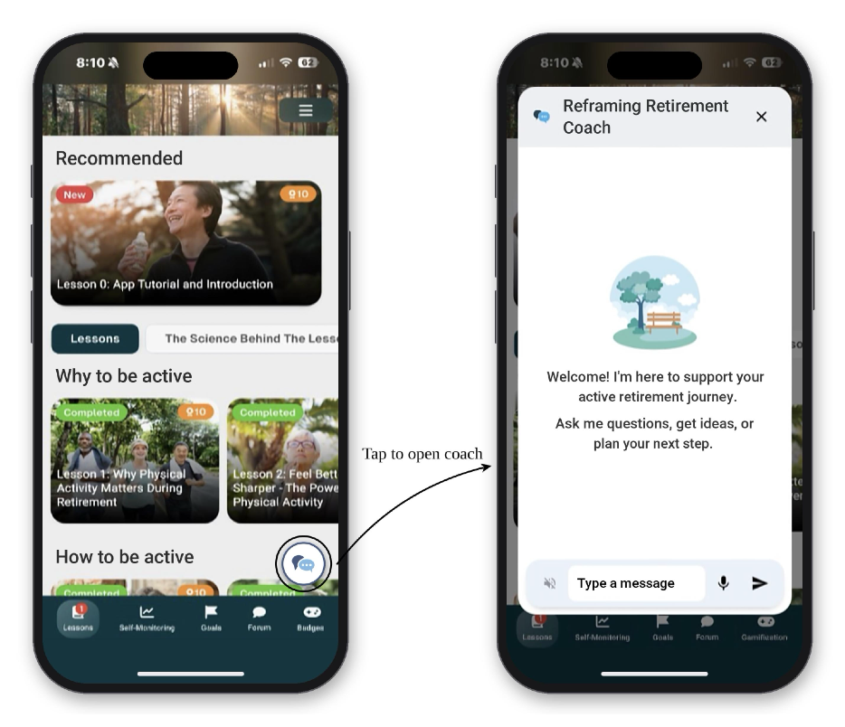
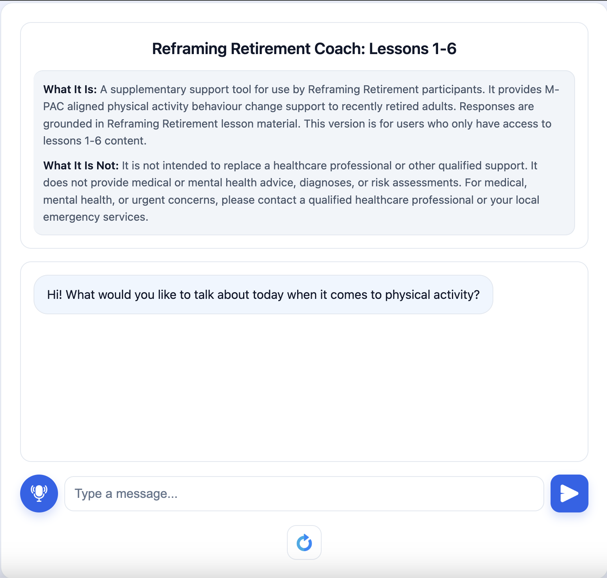

# Reframing Retirement AI Coach

## What it is

- A supplementary support tool for Reframing Retirement participants.
- M-PAC aligned physical activity behaviour change support for recently retired adults.
- Grounded in Reframing Retirement lesson material. This version covers lessons 1-6 and Science Behind Lessons 1-3 and 4-6 only.
- For participants in this study group only. Other participants use the full 10-lesson version.

## What it is not

- A replacement for a healthcare professional.
- A source of medical or mental health advice, diagnoses, or risk assessments.
- For medical, mental health, or urgent concerns, contact a qualified healthcare professional or your local emergency services.

## Web test version

The browser interface used for testing and demonstration.

## Running locally

First time setup:

1. Copy `.env.example` to `.env` and set `OPENAI_API_KEY`.
2. Run `scripts/run_local.sh --ingest` to build the Qdrant collections for this copy.

After that, run `scripts/run_local.sh` and open http://localhost:8001.

This version runs only on your machine. It is not deployed.
